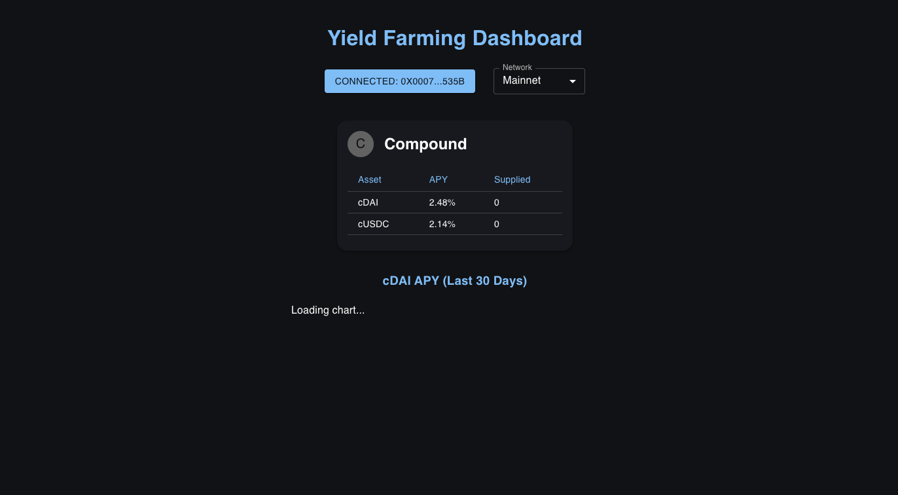

# Yield Farming Dashboard

A modern DeFi dashboard for tracking and managing your yield farming positions across top protocols like **Compound** (with support for Aave, Yearn, and more). Connect your wallet, view your APYs, supplied balances, and compare protocols—all with live blockchain data.

## Features

* **Live APY/Interest rates** from Compound (Aave/Yearn coming soon)
* **Wallet connect** (MetaMask) and network switch (Mainnet, Goerli, Sepolia)
* **User balances**: See what you’ve supplied in each protocol
* **Estimated and realized yield**
* **Deposit/Withdraw (coming soon)**
* **Beautiful dashboard UI** with protocol badges, logos, and dark mode
* **Historic APY charts** via DeFiLlama (if available)
* **Responsive & mobile-friendly**

## Demo

 <sub>*Sample: Compound cDAI/cUSDC with live APY and wallet balances*</sub>

## Quick Start

### 1. Clone the Repo

```bash
git clone https://github.com/ibrahimspy/yield-farming-dashboard.git
cd yield-farming-dashboard
```

### 2. Install Dependencies

```bash
npm install
# or
yarn install
```

### 3. Set up ABIs

* Download the [Compound cToken ABI](https://gist.githubusercontent.com/paulrberg/882e7bc7b2b721a5c9a9727c56e7d04a/raw/1d6b5ac7257e3e1e8dc0981e7e3c4eeb5e9adad2/CToken.json) and place it in `/src/abis/cToken.json`.

### 4. Run Locally

```bash
npm run dev
# or
yarn dev
```

Then open [http://localhost:3000](http://localhost:3000) in your browser.

## Usage

* **Connect Wallet** (MetaMask)
* **Switch Network** as needed (Mainnet recommended for real data)
* **View your supplied balances and live APYs**
* **See historic APY charts** for each supported asset

## Project Structure

```
src/
  abis/           # ABI JSON files (cToken.json, etc.)
  components/     # UI components (ProtocolCard, WalletConnect, ApyChart, etc.)
  context/        # React context for wallet/network
  hooks/          # Custom React hooks (useCompound, useApyHistory, etc.)
  pages/          # Next.js pages (index.tsx)
```

## Data Sources

* **Live APY & balances:** Fetched directly from Compound smart contracts (via ethers.js)
* **Historic APY:** [DeFiLlama API](https://defillama.com/docs/api) (`https://yields.llama.fi/chart/compound/ethereum/DAI` etc.)

## Roadmap

* [x] Compound dashboard with wallet connect & APY
* [x] Historic APY charts (DeFiLlama)
* [ ] Aave & Yearn integration
* [ ] Deposit/Withdraw modal (supply/redeem)
* [ ] Risk badges & protocol filters
* [ ] More analytics (total supplied, earnings projections, multi-wallet)
* [ ] Mobile optimization

## Contributing

PRs and suggestions welcome!
If you want to add new protocols or chart types, check out the `/hooks` and `/components` folders.

## License

MIT

---

**Enjoy farming safely!**
Made with ❤️ by M Ibrahim and the DeFi builder community.
